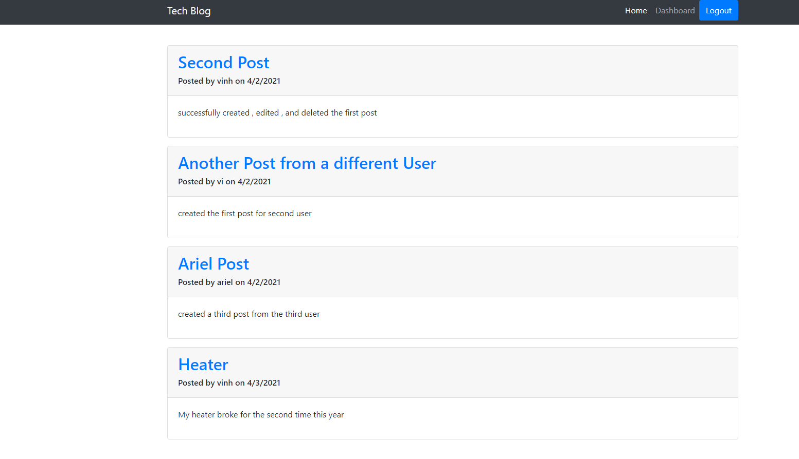
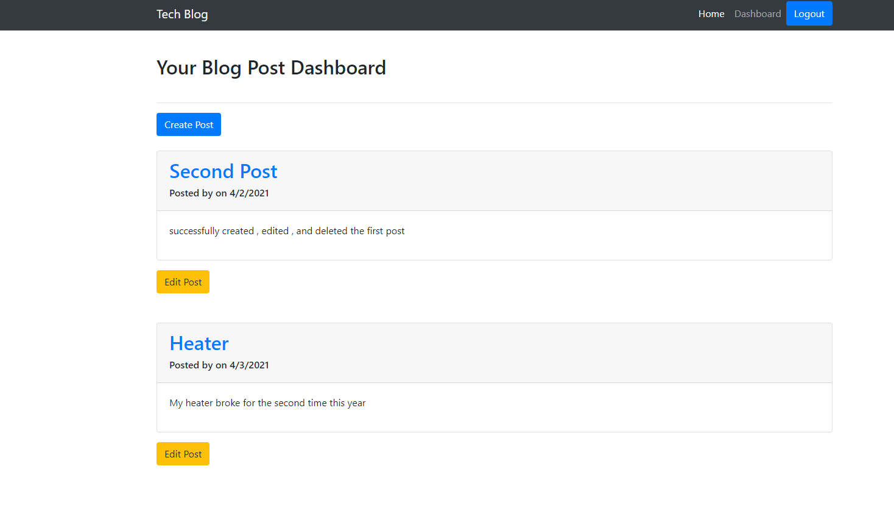
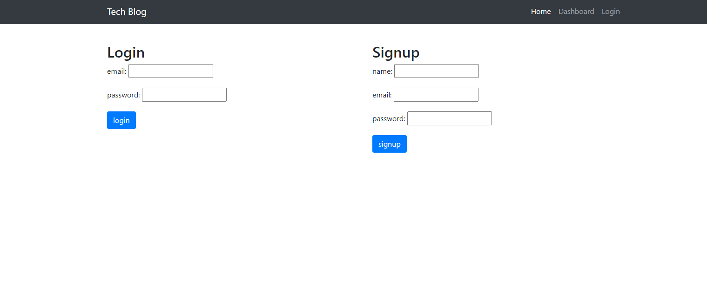

# Tech Blog
  
  
## Description 
  
Creating a blog with login in and log out capability. Once loggin, user can create their own post and comment on other existing post. user can also delete and update existing post when log in.


## Table of Contents

* [Installation](#Installation)
* [Usage](#Usage) 
* [Contributing](#Contributing)
* [License](#License)
* [Questions](#Questions)
  

## Installation 
  
Please run the following command to install required software:

```
npm install	
create db in mysql workbench
npm start
```


## Usage

These are the technologies and languages use for this project: mysql, node js, html, css , 

Deployed Heroku Link:   will be up soon

Github Repository Link: https://github.com/vinhkhamhuynh/tech-blog
  



  
   
## License 
  


 
This project is licensed under the MIT license. For more information, click here: https://spdx.org/licenses/MIT.html 
 


## Questions
  
Please follow me on Github for more projects: [vinhkhamhuynh](https://github.com/vinhkhamhuynh) 

For any questions or to report issues, please email me at: vinhkhamhuynh@gmail.com
  

